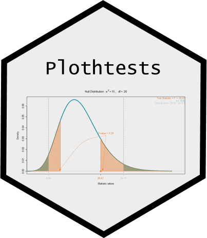
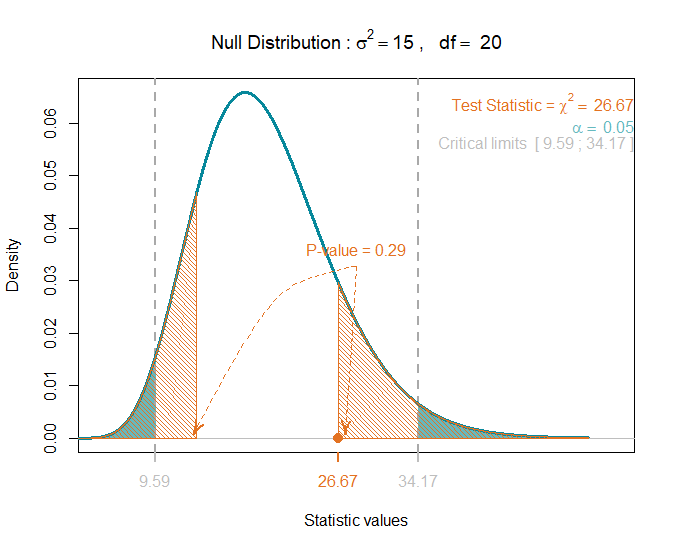
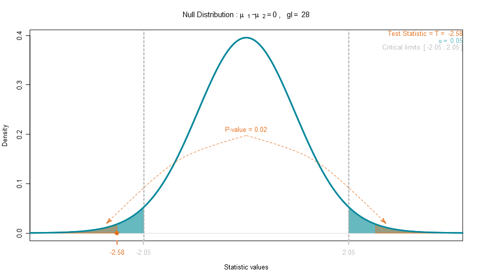

# Plothtests </a>


## Plot hypothesis tests - R Package

This R package was made to help in demonstrate the concepts of hypothesis test, the functions will perfom and plot a hypothesis test, highlithing the test statistic, critical area and limits value, and the p-value.

To install this package just:

```markdown
install.packages("devtools")
library(devtools)
install_github("Zibetti/Plothtests")
library(Plothtests)
```
Then you can perform a hypothesis test using a summary statistic. 

To test one populational variance (Chi-squared test)

```markdown
plot_chi_test(alpha = 0.05,alternative = "two.sided",
              df = 20, va = 20,
              vp = 15,
              annotations = TRUE,
              color = 3)
```


To test the difference of two variances (F-test)

```markdown
plot_F_test(alpha = 0.05, alternative = "two.sided",
            df1 = 10, df2 = 10,
            v1 = 1.5, v2 = 2.5,
            ratio = 1,
            annotations = TRUE,
            color = 3)
```


To test the difference of two means (T-test)

```markdown
plot_T_test(alpha = 0.05, alternative = "two.sided",
            var.equal = "equal",
            n1 = 10, m1 = 2.92, v1 = 1.5,
            n2 = 20, m2 = 4.20, v2 = 1.7,             
            delta0 = 0,
            annotations = TRUE,
            color = 3)
```



<!-- Foo
You can use the [editor on GitHub](https://github.com/Zibetti/Plothtests/edit/master/README.md) to maintain and preview the content for your website in Markdown files.

Whenever you commit to this repository, GitHub Pages will run [Jekyll](https://jekyllrb.com/) to rebuild the pages in your site, from the content in your Markdown files.

### Markdown

Markdown is a lightweight and easy-to-use syntax for styling your writing. It includes conventions for

```markdown
Syntax highlighted code block

# Header 1
## Header 2
### Header 3

- Bulleted
- List

1. Numbered
2. List

**Bold** and _Italic_ and `Code` text

[Link](url) and 
```


For more details see [GitHub Flavored Markdown](https://guides.github.com/features/mastering-markdown/).


### Jekyll Themes

Your Pages site will use the layout and styles from the Jekyll theme you have selected in your [repository settings](https://github.com/Zibetti/Plothtests/settings). The name of this theme is saved in the Jekyll `_config.yml` configuration file.

### Support or Contact

Having trouble with Pages? Check out our [documentation](https://help.github.com/categories/github-pages-basics/) or [contact support](https://github.com/contact) and we’ll help you sort it out.

 -->
